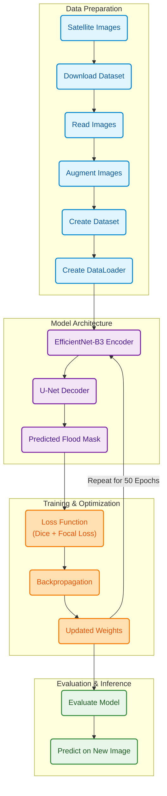

# 🛰️ FloodWatch AI — Disaster Management with Deep Learning

An AI-powered flood detection and monitoring dashboard. It combines a trained
deep-learning model that detects floods in satellite radar imagery with a live
feed of real-world floods happening right now around the world.

---

## What it does

The dashboard (a single web page with an interactive map) has **four modes**:

| Mode | What it does |
|---|---|
| 📡 **Scan** | Click any point on the world map → the system downloads the latest Sentinel-1 radar image for that ~10 × 10 km area from Microsoft Planetary Computer, runs the AI model, and overlays detected flood zones as colored polygons. |
| 🌐 **Live Data** | Pulls **real, currently-active floods worldwide** from GDACS (the UN/EU Global Disaster Alert System). Shows each as a colored marker + text summary, and draws the real affected-area shape on the map when clicked. No AI, no API key — real reported events. |
| 📁 **Upload** | Upload your own 2-band Sentinel-1 GeoTIFF (VV + VH, dB scale) and run the same AI model on it. |
| 📋 **History** | Every AI scan is logged to a local database. Browse, revisit, or delete past scans. |

---

## Architecture

Three programs talking over HTTP:

```
Browser  (public/index.html + Leaflet map)      ← what the user sees
   │  HTTP
   ▼
Node.js + Express  (server.js, port 3000)        ← serves the page, proxies requests,
   │  HTTP                                          logs scans, proxies GDACS feed
   ▼
Python + FastAPI  (main.py, port 8000)           ← the AI engine: loads the model,
                                                    fetches satellite data, runs inference
```

- **Leaflet** is the JavaScript library that draws the interactive map (satellite tiles, markers, flood polygons).
- The Node server never does AI itself — it forwards image/scan requests to Python and records results.
- The Live Data feed is proxied through Node so the browser avoids cross-origin (CORS) issues.

---

## The AI Model (v4)

| Property | Value |
|---|---|
| Architecture | U-Net |
| Backbone | EfficientNet-B3 |
| Input channels | 4 — `VV`, `VH`, `VV/VH ratio`, permanent-water mask |
| Loss | DiceLoss + FocalLoss (α=0.75, γ=2) |
| Dataset | Sen1Floods11 (hand-labeled Sentinel-1 scenes) |
| Model file | `disaster-ai-api/unet_b3.pth` (~53 MB) |
| Training notebook | `old_models_and_tif/colab_model_v4.ipynb` |

### Model Pipeline & Training Workflow



**Inference note:** the model expects a 4th "permanent water" channel that only
exists in the training dataset. For live scans and uploads (arbitrary locations),
that channel is supplied as zeros; the downstream OpenStreetMap water filter
removes permanent water bodies anyway, so the visible result is effectively the same.

**Post-processing** (`main.py`): predictions are thresholded at 0.65, oversized
false-positive blobs (> 5 km²) are dropped, then ocean pixels (global-land-mask)
and permanent water (OpenStreetMap) are filtered out. Each surviving polygon is
sized in km² and assigned a danger level (Low / Medium / High / Critical).

---

## Live Data source — GDACS

[GDACS](https://www.gdacs.org) (Global Disaster Alert & Coordination System, run
by the UN & European Commission) provides a **free, no-key** JSON feed of active
disasters. FloodWatch filters it to floods (`eventlist=FL`) and can fetch each
event's real "affected area" polygon. Alert levels map to color:

- 🔴 **Red** — highest severity
- 🟠 **Orange** — moderate
- 🟢 **Green** — low

---

## Project structure

```
mp-latest/
├── disaster-ai-api/               # Python FastAPI AI engine
│   ├── main.py                    # model load, inference, filtering, endpoints
│   ├── unet_b3.pth                # v4 trained model (4-channel)
│   ├── requirements.txt
│   └── real_flood_test_v4_tif_file.tif   # sample 2-band test image
├── disaster-dashboard/            # Node.js dashboard
│   ├── server.js                  # Express server + GDACS proxy + health check
│   ├── history.js                 # SQLite scan-history module
│   ├── scans.db                   # scan history database
│   └── public/index.html          # the entire frontend (map + UI)
├── old_models_and_tif/            # archived models, TIFs, training notebooks
│   └── colab_model_v4.ipynb       # notebook used to train unet_b3.pth
├── README.md
└── PROGRESS.md                    # staged development log
```

---

## API endpoints

**Python AI engine (port 8000)**
- `POST /predict` — analyze an uploaded GeoTIFF
- `POST /predict-live` — fetch satellite data for a bbox and analyze it

**Node dashboard (port 3000)**
- `GET  /api/health` — reports whether the Python engine is reachable
- `POST /api/analyze-satellite` — proxy an upload to the AI engine, log result
- `POST /api/live-analyze` — proxy a live scan to the AI engine, log result
- `GET  /api/live-floods` — active worldwide floods from GDACS
- `GET  /api/live-floods/shape?eventid=&episodeid=` — one event's affected-area polygon
- `GET/DELETE /api/history[/:id]` — read / delete scan history

---

## How to run

**1 — AI engine (Python)**
```bash
cd disaster-ai-api
python -m venv .venv
# Windows: .\.venv\Scripts\Activate.ps1   |   macOS/Linux: source .venv/bin/activate
pip install -r requirements.txt
python main.py            # starts on http://127.0.0.1:8000
```

**2 — Dashboard (Node)**
```bash
cd disaster-dashboard
npm install
node server.js            # starts on http://localhost:3000
```

**3 — Open** http://localhost:3000

> The **Live Data** and **History** tabs work with only the Node server running.
> The **Scan** and **Upload** tabs need the Python AI engine running too — the
> header status dot turns teal ("AI Engine online") when it's reachable.

---

## Tech stack

**AI:** PyTorch · segmentation-models-pytorch (U-Net + EfficientNet-B3) · rasterio ·
rioxarray · geopandas · shapely · osmnx · global-land-mask · FastAPI · uvicorn ·
Microsoft Planetary Computer (Sentinel-1 RTC)

**Dashboard:** Node.js · Express · Leaflet · better-sqlite3 · axios · multer · GDACS feed
